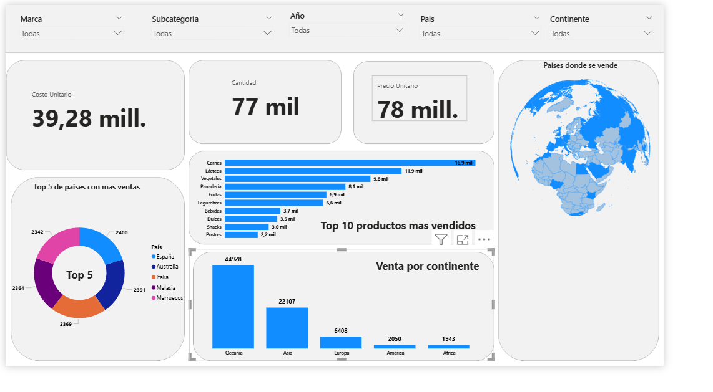
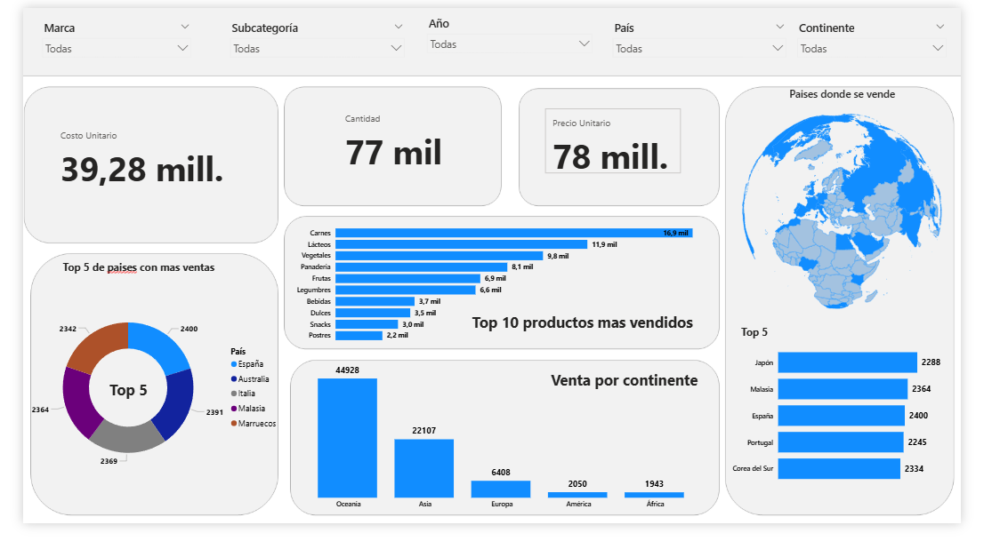

###**Análisis de Ventas**

##**Objetivo**

Analizar los datos de ventas globales para identificar los países, marcas y regiones más rentables, evaluar márgenes de ganancia y volúmenes de ventas, y generar un dashboard interactivo que facilite la detección de oportunidades de crecimiento y tendencias de mercado.

#Explicacion

En este primer avance desarrollé un dashboard en Power BI a partir de un excel que hace la funcion de base de datos 

### Lo que hice en este paso:
- **Limpieza básica de datos**: Estandarice la colomna de fecha para no tener problema de no tener un formato compatible

- **Creación de KPIs iniciales**:c
  - Precio unitario
  - Costo unitario
  - Cantidad 
- **Visualizaciones**:
  - Barra horizontal: top 10 de productos más vendidos.
  - Barra de columna: distribución de ventas por continente.
  - Gráfico circular: top 5 países con mayor volumen de ventas.
  - Tarjetas: precio unitario promedio, costo unitario promedio y cantidad total de ventas.
  - Mapa mundial: distribución geográfica de las ventas.
  
  

**---------------------------------------------------------------------------------------------**

### Lo que hice en este paso:

  - Añadí el gráfico de Top 5 países por ventas para complementar el análisis.
  - Cambié la paleta de colores del gráfico de anillo para mejorar la visualización.

  