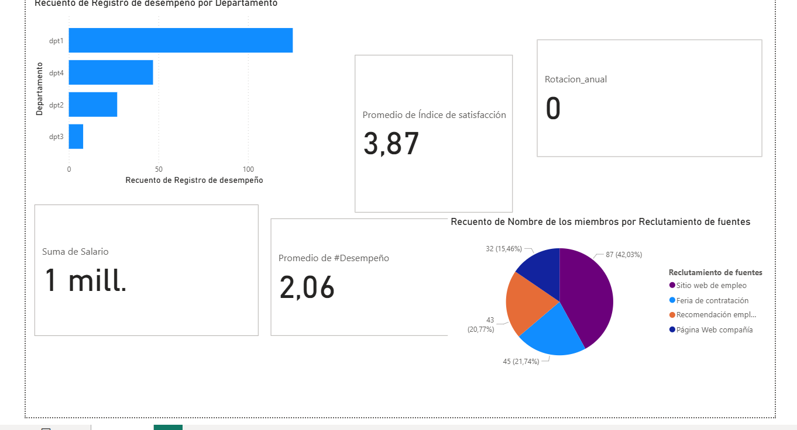
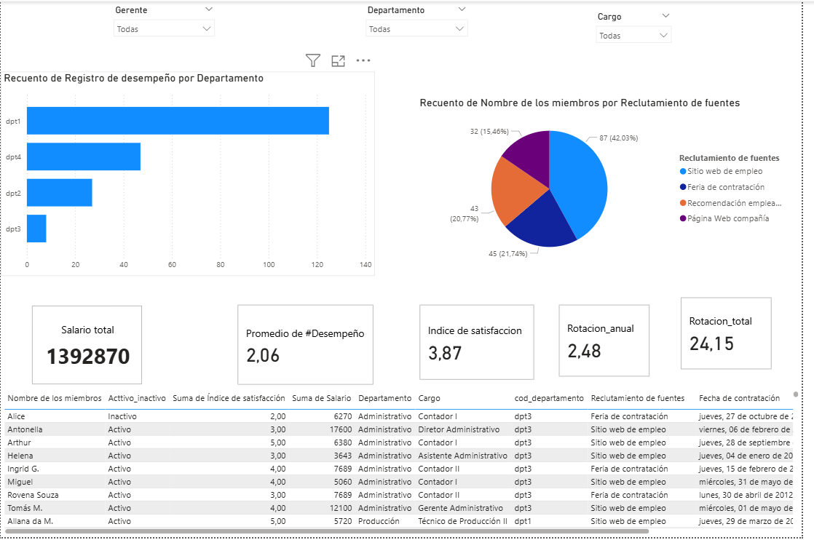

###**Análisis de Recursos Humanos y Satisfacción Laboral**

##**Objetivo**

Analizar la base de empleados para identificar patrones en rotación, desempeño, satisfacción y costos de nómina, y presentar los hallazgos en un dashboard interactivo.

#Explicacion
En este primer avance desarrollé un dashboard en Power BI a partir de un excel que hace la funcion de base de datos 

### Lo que hice en este paso:
- **Limpieza básica de datos**: separación de columnas de salario y cargo, estandarización de campos.  
- **Creación de KPIs iniciales**:c
  - Salario total.
  - Promedio del índice de satisfacción.
  - Promedio del desempeño (conversión de valores de texto a números).
  - Rotación anual (en construcción).  
- **Visualizaciones**:
  - Barra horizontal: distribución del desempeño por departamento.
  - Gráfico circular: reclutamiento por fuente.
  - Tarjetas: salario total, promedio de desempeño, índice de satisfacción, rotación anual.

---------------------------------------------------------------------------------------------
### Lo que hice en este paso:

- Añadí **segmentación de datos** por gerente, cargo y departamento para hacer el dashboard más interactivo.  
- Creé una **columna calculada de estado** para clasificar a los empleados entre **Activos** y **Ex-empleados**.  tuvieran fecha de salida
- Incorporé una **tabla dinámica** para visualizar el detalle de los empleados filtrados.  
- Creé la columna **Año de salida** para facilitar el análisis temporal.  
- Implementé la métrica de **rotación anual** diferenciando empleados activos y los que salieron.  
- Refiné los KPIs y mejoré la navegación entre visualizaciones.  

